# Example Stacks

Deployable [Alchemy](https://alchemy.run) stacks that provision real Nebius resources. Each file is a complete stack — copy one, or just deploy it directly.

Environment variables are read from `.env` (see [`.env.example`](.env.example)):

| Variable            | Required        | Description                                          |
| ------------------- | --------------- | ---------------------------------------------------- |
| `NEBIUS_API_KEY`    | yes             | Auto-populated from the Nebius CLI (or set manually) |
| `NEBIUS_PROJECT_ID` | yes             | Target project                                       |
| `NEBIUS_TENANT_ID`  | for some stacks | Needed by the actions example and Worker bindings    |
| `NEBIUS_REGION`     | no              | Defaults to `eu-north1`                              |

> ⚠️ These stacks create real, billable resources in your Nebius project. Always run `alchemy destroy --yes` when you're done.

> The **mermaid diagrams** below show each stack's resource graph as it is declared, with the
> **logical ids** from the source (`TestSubnet` is the `yield*` call's first argument) and the props that
> create each edge (`network -- networkId --> subnet` is `networkId: network.id`). Dashed edges are
> snippets that are commented out in the file. They are generated from the files by
> [`../spikes/extract-example-graphs.mjs`](../spikes/extract-example-graphs.mjs), so they can be
> re-derived rather than trusted. `storage.ts` (one bucket) and `actions.ts` (read-only, no state) are left
> without one: there is no graph to draw.

## Core Resources

### [storage.ts](storage.ts) — Object Storage bucket

The minimal starting point: creates a single Nebius Bucket and returns its id, name, and state. Demonstrates the simplest possible `Alchemy.Stack` with auto-generated names.

### [vpc.ts](vpc.ts) — Full VPC topology

Creates a complete networking stack: Network, Subnet, RouteTable, Route (default egress gateway), SecurityGroup, SecurityRule (stateful, TCP 80/443 ingress), IP Pool, and Allocation. All names are omitted from props and auto-generated from logical IDs.

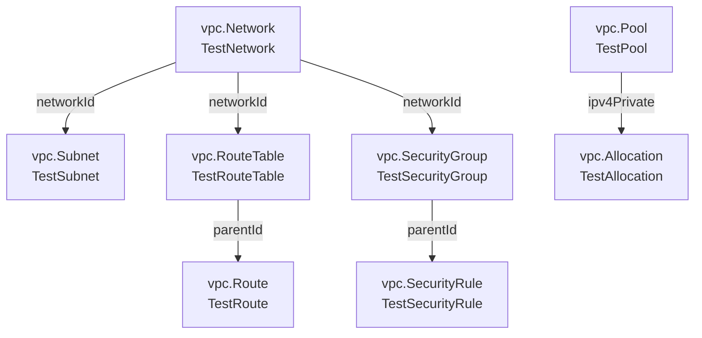

### [dns.ts](dns.ts) — DNS zone and record

Creates a VPC network (as zone scope), a VPC-scoped DNS zone for `alchemy-demo-test.com.`, and an `A` record at the zone apex (`@`) pointing to `192.0.2.1`.

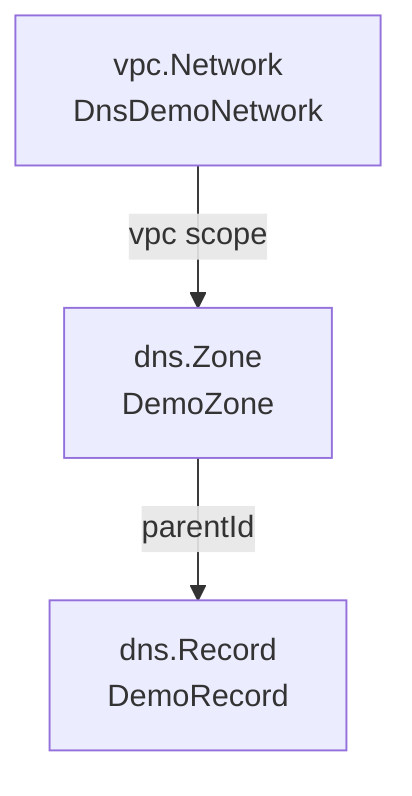

### [iam.ts](iam.ts) — Service account, static key **and S3 access key**

Creates a ServiceAccount, then both credential types: a `StaticKey` (CONTAINER_REGISTRY — the non-standard `Issue` lifecycle, where the token exists only in the issue response) and a v2 `AccessKey` — the **AWS-format** `awsAccessKeyId`/`secretAccessKey` pair Object Storage needs, which a StaticKey is not. Both are one-time secrets; `secretDeliveryMode` is where you choose whether that secret stays inline (local state) or lands in a MysteryBox instead.

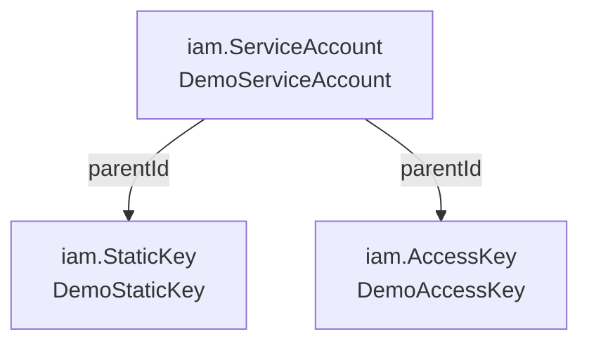

### [kms.ts](kms.ts) — KMS keys

Creates both KMS key types: a SymmetricKey (AES_256) and an AsymmetricKey (ECDSA_NIST_P256_SHA_256), each with auto-generated names.

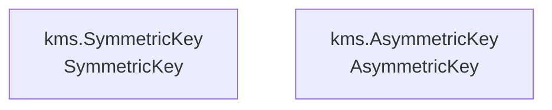

### [mysterybox.ts](mysterybox.ts) — Secrets and versions

Creates a Secret with an initial version and payload, then adds a second version (`v2`) with updated credentials and `setPrimary: true` to promote it as primary.

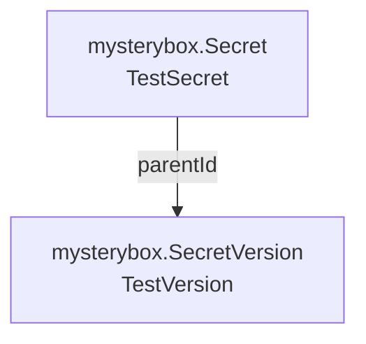

### [compute.ts](compute.ts) — Image → Disk → Filesystem → Instance

Dynamically looks up the latest Ubuntu 22.04 LTS image by family, creates a NETWORK_SSD boot disk from it, creates a shared `NETWORK_SSD` filesystem, then launches a preemptible instance (`gpu-h200-sxm`) with that disk as its boot disk and the filesystem mounted at `mountTag: 'data'`. Requires `SUBNET_ID` and `SERVICE_ACCOUNT_ID`; `IMAGE_FAMILY` and `DISK_SIZE_GB` are optional. A commented snippet after the stack shows the snapshot → restore pair (`DiskSnapshot` as a third disk create source). One attribute looks like a number and is not: `Filesystem.sizeGibibytes` is an int64 in the JSON rendering, so it reads back as a **string**.

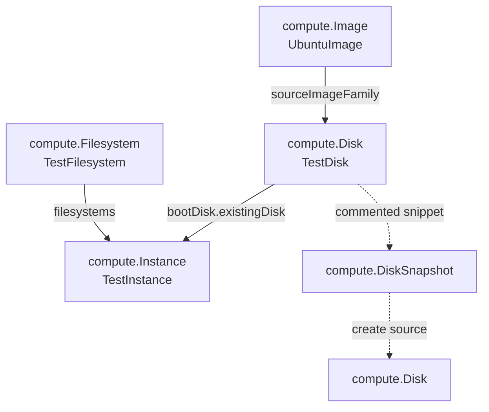

### [mk8s.ts](mk8s.ts) — Managed Kubernetes cluster + one worker node

Creates a working control plane and a real worker node: network → subnet → cluster, plus a service account with an `editor` grant (group → permit → membership) whose id the node template needs for registry pulls and API access, then a `cpu-d3` node group with a 64 GiB boot disk and cloud-init user-data. It is the example that shows the non-obvious parts: the parent is the **cluster** (no project fallback), `fixedNodeCount` and `autoscaling` are mutually exclusive and one is required, `os`/`driversPreset` come from `Nebius.mk8s.action.GetNodeGroupCompatibilityMatrix` rather than a local list, and `etcdClusterSize: 1` keeps the demo cheap (non-HA). The commented block in the node template lists the optional surface — `strategy`, `autoRepair`, node/instance labels, taints, `maxPods`, `preemptible`, filesystems, capacity reservations, GPU and NVLink — with the caveats for each. **⚠️ Provisions a real billable VM** and is the slowest stack here (a node group takes minutes to `RUNNING` and its delete waits for the VM).

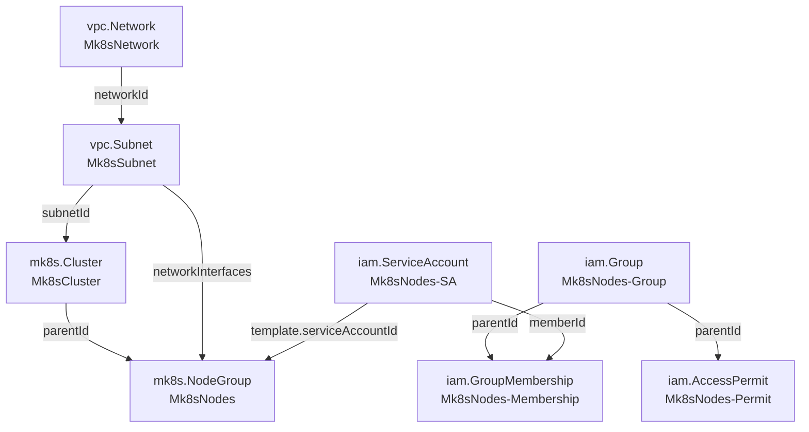

### [spot-pricing.ts](spot-pricing.ts) — Spot pricing: a bid and the `pricing` prop

Creates a `billing.PricingPolicy` — a project-scoped auction bid that caps what a preemptible GPU VM may
pay per hour, and which provisions nothing — plus a `compute.Instance` that pins `pricing: { onDemand: true }`.
The prop (also on `mk8s.NodeGroup.template`, `ai.Job` and `ai.Endpoint`) is a deliberate reshape of a flat
proto oneof, so it reads as one choice: `{ onDemand: true }`, `{ followsSpotPrice: true }` or
`{ spotPricingPolicy: { id: policy.id } }`. The API requires the arm to match `preemptible`, which is a
**plan-time error** here. The two spot arms are commented because they need `preemptible`, and this tenant's
CPU platforms reject it (`3 INVALID_ARGUMENT: Preemptible is invalid`) — they need GPU capacity. The comments
carry the measured caveats: the API normalizes the price (`'3.000'` → `'3'`), a sub-market bid is accepted but
blocks scheduling (`SCHEDULING_STATE_BLOCKED`), the service **discards** `metadata.labels`, its `Update` RPC
rejects every documented shape (so a spec change is a replace), and on `compute.Instance` a pricing change is
only accepted on a **stopped** VM. **⚠️ Deploys a real VM** (one `4vcpu-16gb`).

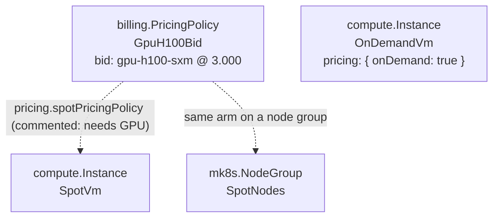

## Discovery Actions

### [actions.ts](actions.ts) — Read-only list/get actions

Demonstrates the read-only discovery actions: list-all and single-get for IAM projects/groups, VPC networks/subnets/route tables, and quotas. No state is created — each action is a pure read visible in `alchemy plan`. Requires `NEBIUS_TENANT_ID`.

## Cloudflare Worker Bindings

The bindings examples ship typed Nebius S3 clients to a Cloudflare Worker at deploy time (host identity mint, editors-group grant, access key, and `NEBIUS_S3_*` env injection). Each has a stack file plus a separate Worker entry file — keeping the entry out of the stack keeps the deployed bundle free of provider/runtime machinery.

### [storage.bindings.ts](storage.bindings.ts) — Effect-native Worker (inline form)

The Worker entry ([storage.bindings-worker.ts](storage.bindings-worker.ts)) is a `Cloudflare.Worker` with an inline `Effect.gen` implementation. It declares the bucket, consumes the typed `GetObject`/`PutObject` runtime clients, and exposes a `GET`/`POST` HTTP API. Uses narrow deep-subpath imports so rolldown can tree-shake the handler bundle. Requires a Cloudflare API token or `alchemy profile edit --add Cloudflare`.

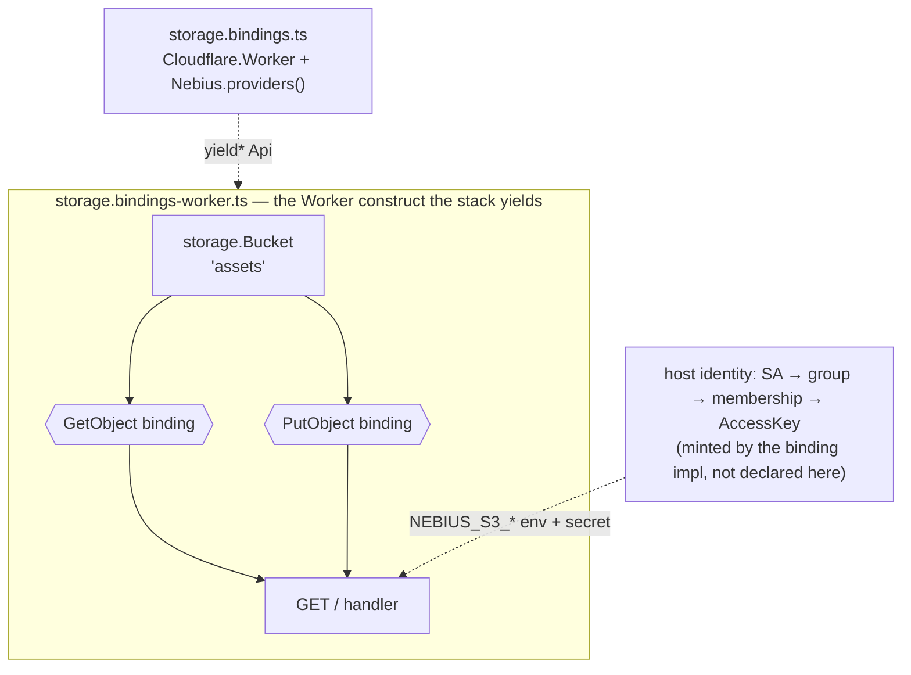

### [storage-async.bindings.ts](storage-async.bindings.ts) — Async Worker (tiny bundle)

Same deploy-time wiring as `storage.bindings.ts`, but the Worker entry ([storage-async.bindings-worker.ts](storage-async.bindings-worker.ts)) is a plain async function with no Effect runtime — it reads `env` and drives s3-lite-client directly. Deployed size is a fraction of the Effect-native variant (~50–150 KB vs ~2 MB). The trade: you lose the typed `GetObject`/`PutObject` contracts inside the worker.

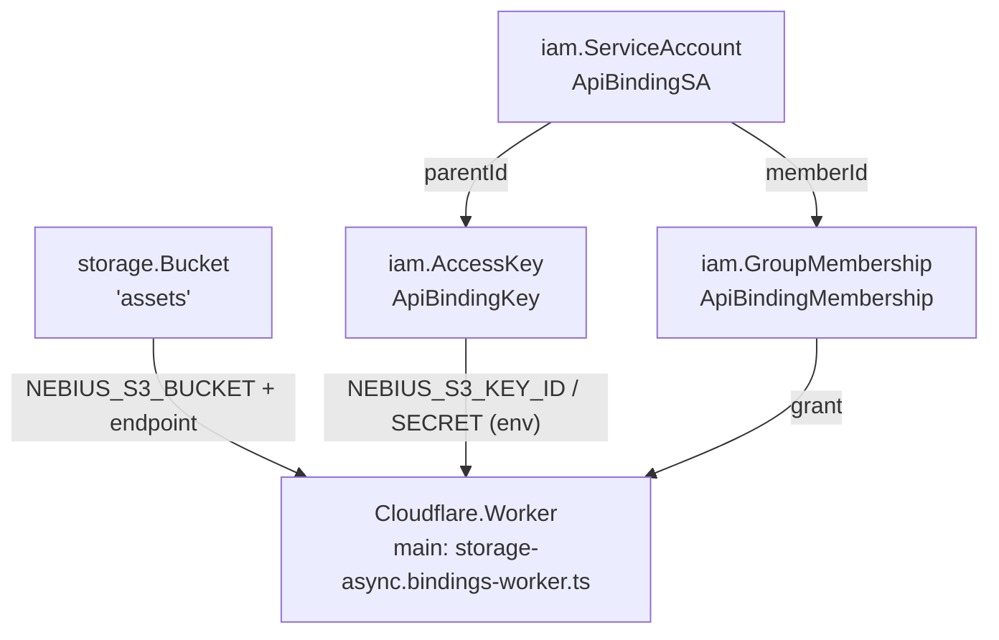

### [ai.bindings.ts](ai.bindings.ts) — AI endpoint ChatCompletions

The Worker entry ([ai.bindings-worker.ts](ai.bindings-worker.ts)) declares an inference endpoint (network + subnet + the official vLLM Qwen3-0.6B config from the Nebius Serverless AI cookbook — L40S GPU) and consumes the typed `ChatCompletions` runtime client: deploy-time `NEBIUS_ENDPOINT_URL`/`NEBIUS_ENDPOINT_AUTH_TOKEN` injection (the token deploys as a Cloudflare secret), a fetch-based OpenAI-compatible client at runtime. Auth is a bearer token — unlike the S3 bindings there is no identity minting or IAM grant. The provider awaits the endpoint to RUNNING before wiring the URL (progress notes included); a broken endpoint fails with `EndpointNotReady`. See [AI_BINDINGS.md](../AI_BINDINGS.md) for the design.

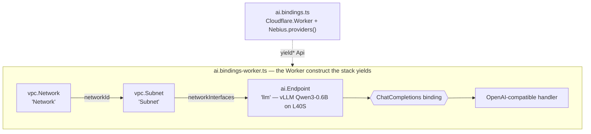

## Hosted programs on a VM

### [ai-chat-instance.ts](ai-chat-instance.ts) — a bundled program served by systemd

The instance-host counterpart of [ai.bindings.ts](ai.bindings.ts) (which targets a Cloudflare Worker). One
stack deploys a **GPU vLLM endpoint** and a **hosted instance** whose program
([ai-chat-instance-program.ts](ai-chat-instance-program.ts)) is bundled, shipped to an S3 assets bucket,
fetched and served by systemd — answering `GET /?prompt=…` with a real chat completion. The difference from
the Worker example is the reason the file exists: a bundle is never executed by the CLI, so the binding must
be registered on the **deploy** side (the inline init Effect on the instance), and its env lands in the
systemd EnvironmentFile the VM reads at runtime. **This file defaults to the cheap configuration** — a
CPU-only endpoint serving `Qwen2.5-0.5B-Instruct` with llama.cpp — with the production-shaped GPU variant
(L40S + vLLM) kept as a commented block; measured on real infra: deploy 341 s, a completion on the first
`curl`, 36 SSE frames for `&stream=1`, destroy 192 s. **⚠️ Billable**, and the GPU variant much more so.

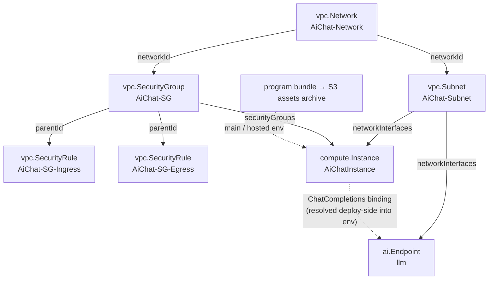

## Coverage — every resource, audited

**41 resources; 29 demonstrated, 3 commented-only, 9 absent.** The audit is mechanical, so it can be
re-run rather than trusted: walk `modules/resources/**` for `Alchemy.Resource<'Nebius.…'>` type strings,
then classify each mention in `examples/*.ts` by whether its line is commented out. (It was last run
2026-09-24, which is how the gap in this section — a coverage table whose rows had drifted out of the
table, and `ai-chat-instance.ts` having no section at all — came to light.)

### Commented, not runnable (3) — a snippet shows the shape, deploying it would need entitlement or be pointlessly costly

| resource | where, and why it stays a snippet |
| --- | --- |
| `Nebius.compute.GpuCluster` | [compute.ts](compute.ts) (fabric discovery → group → instance membership). Snippet only: the group needs a physical InfiniBand fabric id |
| `Nebius.compute.NVLInstanceGroup` | [compute.ts](compute.ts). Snippet only: deploying it needs the `GB200`/`GB300` entitlement, so it would fail on quota rather than teach anything |
| `Nebius.compute.DiskSnapshot` | [compute.ts](compute.ts) — the snapshot → restore pair. As a stack it would add a second disk for no new lesson |

### Not yet written (4) — genuine gaps, none of them blocked by this tenant

| resource | what a file would add |
| --- | --- |
| `Nebius.storage.Transfer` | the only `storage` resource without a file: two buckets, an access key and a stop condition (`afterOneIteration` / `afterNEmptyIterations` / `infinite`, which the props reshape from three flat oneof fields) |
| `Nebius.iam.AuthPublicKey` | a pinned RSA-4096 public key — the API accepts **only** that shape, enforced by a plan-time filter |
| `Nebius.iam.FederatedCredentials` | OIDC federation for CI: an issuer/subject pair from an identity provider |
| `Nebius.ai.Job` | the low-level compute job behind `ai.Endpoint`. Needs GPU quota and runs for minutes; [ai.bindings.ts](ai.bindings.ts) already covers the AI path end to end |

### Deliberately not demonstrated (5) — a stack would be an accident waiting to happen

| resource | why |
| --- | --- |
| `Nebius.iam.Invitation` | creating one sends **real email to a real person** (the same reason the live-echo audit excludes it) — an example is one `alchemy deploy` away from being run by accident |
| `Nebius.quotas.QuotaAllowance` | it mutates the tenant's **real quotas**, and its identity is the `(parent, name, region)` tuple because the service has no stable `id` |
| `Nebius.iam.Federation` | tenant-scoped SSO: needs tenant-admin rights and a real identity provider's metadata, none of which a project-scoped example can supply |
| `Nebius.iam.FederationCertificate` | the certificate half of that SSO configuration: a real IdP's signing certificate, and tenant-admin rights to install it |
| `Nebius.iam.Project` | the one resource here that is **not** project-scoped — a stack would create a whole new project (with its own billing/entitlement context) rather than something inside the current one |

## Companion Files

- [.env.example](.env.example) — optional default tenant/project IDs for the examples
